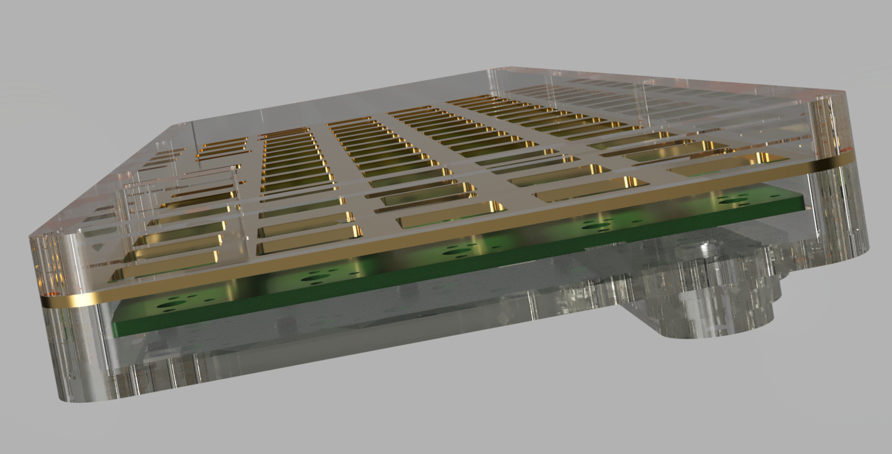

# mullet
The gerber files included are everything needed to have this PCB printed. However, to open and edit this PCB in KiCad you will need to use a newer nightly development build because of some of the scripting for teardrops and features saved in the files that are not yet available in the most recent stable build.

This should eventually be able to be opened with the next stable KiCad release, but for now it can only be opened and edited with nightly builds.

***When using a KiCad nightly build please take caution with any other projects that need to remain compatible with older builds of KiCad. Saving them with a nightly build will make them incompatible with past stable builds because of new features not yet implemented.***

